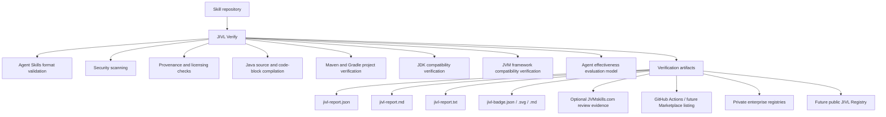

# JIVL — JVM Intelligence Verification Layer

**Status: early-stage MVP (`0.1.0-SNAPSHOT`). Not released. APIs, CLI flags,
report/badge schemas, and module boundaries may change without notice.**

JIVL is an independent, open-source verification layer for JVM-focused Agent
Skills. It inspects a skill directory and produces evidence — not a single
opaque score — about whether the skill is structurally valid, reasonably
safe to inspect, properly attributed, compatible with its declared JVM
environment, backed by compilable or testable examples, and ready for a
future effectiveness evaluation.

> JIVL is not an official OpenJDK, Oracle, Spring, Agent Skills, Anthropic,
> OpenAI, GitHub, SkillsJars, or JVMskills.com project. "JIVL" is a working
> project name pending final domain and trademark clearance.

## Product Flow



## Problem Statement

Agent Skills are spreading fast, but "does this skill actually work on the
JVM stack I run" is an unanswered question for most of them. Structural or
frontmatter linting tells you a skill is *well-formed*. It tells you nothing
about whether the Java it ships compiles, whether its Maven/Gradle project
actually builds and tests green, which JDK versions were *really* exercised
(versus merely declared), or whether using the skill measurably changes an
agent's output.

## What Makes JIVL Different

> JVM-native verification evidence for Agent Skills: deterministic structure,
> security, and provenance checks combined with Java compilation,
> Maven/Gradle build execution, declared JDK/framework compatibility, and
> reproducible effectiveness-evaluation contracts.

JIVL does not claim static scanning proves a skill is completely safe, and it
does not claim a skill improves an agent unless a baseline-vs-with-skill
evaluation has actually executed and produced verifiable results. See
`docs/competitive-landscape.md` for how this compares to existing tools.

## Target MVP Scope

Nothing below is implemented yet unless explicitly marked **Implemented
(Phase 0)**. See `docs/implementation-status.md` for the current,
evidence-based build/test state, and `docs/implementation-plan.md` for the
phase gates.

### Implemented (Phase 0)

- Java 21 Maven multi-module reactor (root `pom.xml` plus module POMs) that
  builds successfully via the Maven Wrapper.
- Governance, contributor, and RFC/ADR process documentation.
- GitHub Actions CI foundation running `./mvnw -B -ntp clean verify`.

No verification rule, CLI command, report, badge, or registry endpoint
exists yet. Module directories other than their `pom.xml` are currently
empty.

### Planned for Phase 1 — Verify engine and CLI

- Native Java implementation of Agent Skills structural/frontmatter validation.
- Deterministic static security scanning with redacted evidence.
- Optional `jivl.yaml` provenance manifest validation.
- Java source/code-block detection and (optional, opt-in) compilation.
- Maven and Gradle project detection, metadata extraction, and (optional,
  opt-in) build execution.
- JDK and JVM-framework compatibility evidence, with a hard distinction
  between *declared* and *verified*.
- A Picocli-based CLI (`jivl-cli.jar`).

### Planned for Phase 2 — Reports, badges, CI groundwork

- Text, Markdown, and JSON reports, plus a locally generated SVG trust badge.
- Example GitHub Action workflow groundwork (not the Action itself — see
  Phase 4/documentation-only items below).

### Planned for Phase 4 — Registry

- A read-only, file-backed registry website (Spring Boot + Thymeleaf) for
  browsing generated reports.

### Provider-neutral effectiveness evaluation (Phase 1/2, cross-cutting)

- A provider-neutral, non-fabricating agent-effectiveness evaluation model
  (baseline vs. with-skill), reporting "Evaluation Pending" when no agent
  adapter is configured.

### Documentation-only future phases

- `jivl-github-action` composite Action wrapper: prototype, not published.
- JIVL Academy / JIVL Research (Phase 5) and JIVL Enterprise / Marketplace
  (Phase 6): documentation only, see `docs/roadmap.md` and the linked
  roadmap docs. No production functionality is planned for these in this
  MVP.

## Explicit Non-Goals (for this MVP)

- No hosted attestation service, no cryptographic signing, no revocation.
- No JIVL Academy or JIVL Research production functionality (documented only).
- No JIVL Enterprise multi-tenant or Marketplace/payment functionality
  (documented only).
- No arbitrary remote code execution, no automatic tool installation, no
  execution of skill-declared shell commands.
- No GraalVM native-image build in this task (documented as a roadmap item).
- No database — the registry is file-backed against `registry-data/`.

## Module Overview

Target responsibility per module (see "Target MVP Scope" above for what is
actually implemented today — Phase 0 only, no production logic yet):

| Module | Responsibility |
|---|---|
| `jivl-core` | Domain model, orchestration contracts, findings, no Spring/Picocli/build-tool code |
| `jivl-security` | Static security rules (secrets, destructive commands, Unicode tricks, etc.) |
| `jivl-maven` | Maven project detection, metadata extraction, bounded build execution |
| `jivl-gradle` | Gradle project detection, metadata extraction, bounded build execution |
| `jivl-reporting` | Text/Markdown/JSON reports, canonical digesting, SVG badge generation |
| `jivl-evaluations` | Evaluation-spec parsing, baseline/with-skill result model, provider-neutral adapters |
| `jivl-cli` | Picocli CLI composing the modules above into `jivl-cli.jar` |
| `jivl-registry` | Read-only Spring Boot + Thymeleaf website/API over generated reports |
| `jivl-test-fixtures` | Shared, original test-only fixtures |
| `jivl-github-action` | Composite Action wrapper invoking the CLI (prototype, not published) |

See `docs/architecture.md` for dependency-direction rules and `AGENTS.md` for
the concise contributor-facing map.

## CLI Quick Start

> **Planned interface — not implemented or released yet.** `jivl-cli.jar`
> does not exist yet; `jivl-cli` currently has only a placeholder `pom.xml`.
> The commands below describe the intended Phase 1 interface.

```bash
./mvnw -B -ntp clean package
java -jar jivl-cli/target/jivl-cli.jar verify samples/valid-java-skill \
  --output target/reports/valid --format all
```

Key options: `--format text|json|markdown|all`, `--fail-on-warn`,
`--run-builds`, `--allow-build-network`, `--build-timeout-seconds <n>`,
`--jdk-home <version=path>` (repeatable), `--commit-sha <sha>`, `--verbose`.

Exit codes: `0` PASS/WARN, `1` any FAIL, `2` invalid usage/input, `3` WARN
with `--fail-on-warn`, `4` internal JIVL error.

### Example Text Report (illustrative — Planned interface, not implemented or released yet)

```
JIVL Verification Report
Skill: valid-java-skill (v1.0.0)
Result: PASS
--------------------------------------------------
STRUCTURE   [PASS] frontmatter valid, name matches directory
SECURITY    [PASS] no suspicious patterns detected (best-effort)
PROVENANCE  [WARN] jivl.yaml not present
JAVA        [PASS] 1 compilation unit compiled with JDK 21
MAVEN       [SKIPPED] no pom.xml present
EVALUATION  [PENDING] no agent provider configured
--------------------------------------------------
Findings: 0 FAIL, 1 WARN, 3 PASS, 1 SKIPPED
Advisory: static and build-time checks do not prove complete safety.
```

### Example Markdown Report (illustrative — Planned interface, not implemented or released yet)

```markdown
## JIVL Verification: PASS WITH WARNINGS

| Category | Status |
|---|---|
| Structure | PASS |
| Security | PASS |
| Provenance | WARN — jivl.yaml missing |
| Java | PASS — compiled with JDK 21 |
| Evaluation | PENDING |

_This report is advisory. It is not proof of complete safety or of agent
effectiveness improvement._
```

## Badge Trust Model

> **Planned interface — not implemented or released yet.** No badge
> generation code exists yet.

A badge only ever reflects report content — it cannot be hand-set. The MVP
only ever emits `LOCAL_SELF_VERIFICATION` or `CI_SELF_VERIFICATION`
attestation types; it never emits (and never displays) a hosted attestation,
because that service does not exist yet. See
`docs/badge-and-attestation-model.md`.

## Registry Website

> **Planned interface — not implemented or released yet.** `jivl-registry`
> currently has only a placeholder `pom.xml`; no Spring Boot application
> code exists yet, and no `jivl-registry-0.1.0-SNAPSHOT.jar` is produced.

`jivl-registry` is a read-only Spring Boot app that renders JSON reports
already sitting in `registry-data/`. It never executes a skill, a build, or
a script. Once implemented, it will be started (after building) with:

```bash
java -jar jivl-registry/target/jivl-registry-0.1.0-SNAPSHOT.jar
```

## Build Instructions

**Linux / macOS**
```bash
./mvnw -B -ntp clean verify
```

**Windows**
```bat
mvnw.cmd -B -ntp clean verify
```

Requires JDK 21. The wrapper downloads its own Maven distribution and all
dependencies from Maven Central on first run — a machine with no network
access cannot complete this build (see `docs/implementation-status.md` for
current environment-verification status).

## Security Warning: `--run-builds`

`--run-builds` executes the *skill's own* Maven/Gradle project using its own
wrapper (or an installed Maven/Gradle) as a real child process. This is
running repository-controlled build logic (plugins, build scripts) on your
machine. Only pass `--run-builds` for skills you trust enough to build
locally, and prefer offline mode (the default) unless you also intend to
pass `--allow-build-network`.

## Roadmap

Phase 0–4 are in scope for this MVP (foundation → Verify engine/CLI →
reports/badges/CI → JVMskills.com integration proposal → read-only registry).
Phase 5 (JIVL Academy / JIVL Research) and Phase 6 (JIVL Enterprise / JIVL
Marketplace) are documentation-only in this MVP — see `docs/roadmap.md`,
`docs/academy-roadmap.md`, `docs/research-roadmap.md`,
`docs/enterprise-roadmap.md`, and `docs/marketplace-roadmap.md`.

## Contributing

See `CONTRIBUTING.md`, `AGENTS.md`, and the RFC process at
`docs/rfcs/README.md`. Governance is described in `GOVERNANCE.md`.

## Attribution

Created by Nityam Jigyasu ([@nmj18txstate](https://github.com/nmj18txstate)).

JIVL is an independent open-source project and is not affiliated with,
endorsed by, or sponsored by OpenJDK, Oracle, Spring, the Agent Skills
specification maintainers, Anthropic, OpenAI, GitHub, SkillsJars, or
JVMskills.com.

[](LICENSE)
[](https://openjdk.org/projects/jdk/21/)

CI badge intentionally omitted until `.github/workflows/ci.yml` has run
successfully at least once against this repository.
